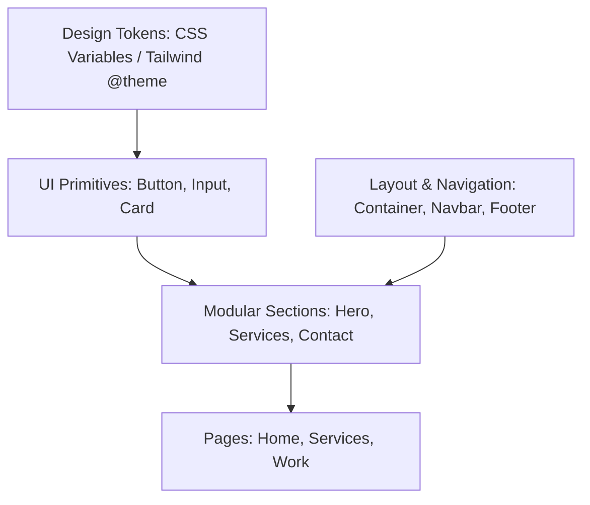

# InfinytTech Frontend Architecture & Design System Specification

This document details the enterprise-grade design system, typography scales, spacing structures, Tailwind config strategy, and long-term scaling guidelines implemented for InfinytTech's frontend.

---

## 1. Project Folder Structure

The application codebase is organized following a strict **Feature-and-Primitive Separation** architecture, ensuring clear separation of concerns:

```text
frontend/src/
├── assets/         # Static assets (images, icons, brand SVGs)
├── components/     # UI Component Library
│   ├── layout/     # Structural grid & layout elements (Container, Section, PageLayout)
│   ├── navigation/ # App navigation components (Navbar, Footer, MobileMenu)
│   └── ui/         # Pure UI Primitives (Buttons, Cards, Inputs, Badges, etc.)
├── constants/      # Global constants (site branding, contact details, social links)
├── data/           # Hardcoded/Mock arrays (services list, testimonials list, process stages)
├── hooks/          # Reusable React hooks (useMediaQuery, useScroll)
├── pages/          # Future page routing templates (Home, ServicesPage, WorkPage)
├── routes/         # Central routes registry (path constants, router setup)
├── sections/       # Configurable, prop-driven website blocks (Hero, Services, Contact, etc.)
├── types/          # Strict TypeScript interfaces & shapes definition
├── utils/          # Global helper functions (cn class combiner)
├── App.tsx         # Main entry point and design system showcase view
├── index.css       # Tailwind CSS v4 design tokens and base styles
└── main.tsx        # Application mount entrypoint
```

---

## 2. Design System Architecture

Our architecture follows an **Atomic Hierarchy** where layout systems and page building blocks consume foundational design tokens:



### Key Architectural Guidelines
*   **Token-Driven**: Never use ad-hoc hex codes or pixel paddings. Always use Tailwind design tokens (e.g., `text-primary-text`, `bg-surface-light`, `p-6`).
*   **Composition over Inheritance**: Components accept children or structured props. Avoid giant custom components that handle multiple unrelated responsibilities.
*   **CSS-First Animation**: Interactive transitions are handled in CSS via Tailwind transitions (e.g., `transition-all duration-300`) to maintain GPU acceleration.

---

## 3. Component Architecture

Components are grouped into three distinct categories based on their functional scope:

| Category | Description | Examples | Styling Rules |
| :--- | :--- | :--- | :--- |
| **UI Primitives** | Stateless, reusable, atomic UI controls. | `Button`, `Input`, `Badge`, `Card` | Fully self-contained. Accepts custom className overrides via `cn` helper. |
| **Layout Systems** | Layout guides that structure content placement on screen. | `Container`, `Section`, `PageLayout` | Do not include text content. Used to manage responsive bounds, margins, and padding. |
| **Modular Sections** | Full-width structural website sections configurable via props. | `HeroSection`, `ServicesSection` | Responsive padding scales, custom section background toggles, standard props interfaces. |

---

## 4. Tailwind Configuration Strategy (Tailwind CSS v4)

Our setup implements a **pure CSS-in-CSS configuration strategy** aligned with Tailwind CSS v4. Instead of a separate JavaScript configuration file, all tokens are defined in `index.css` inside the `@theme` directive. 

### Why this is advantageous:
1.  **Direct CSS Reference**: Tokens are immediately compiled into native CSS variables, making them accessible in standard styles and 3rd party components.
2.  **No Config Bloat**: Eliminates the Javascript parse time for compiling tailwind.config.js.
3.  **HMR Acceleration**: Vite updates variables instantly during development without requiring configuration reload cycles.

---

## 5. Typography Scale

The typography uses the **Inter** font family for a sleek, premium, neo-grotesque style. 

| Token | CSS Font Size | Line Height | Letter Spacing | Ideal Use Cases |
| :--- | :--- | :--- | :--- | :--- |
| `--text-h1` | `3.5rem` (56px) | `1.15` | `-0.03em` | Main hero headings |
| `--text-h2` | `2.25rem` (36px) | `1.2` | `-0.02em` | Section headings |
| `--text-h3` | `1.5rem` (24px) | `1.3` | `-0.015em` | Card, minor headings |
| `--text-h4` | `1.25rem` (20px) | `1.35` | `-0.01em` | Subsection subtitles |
| `--text-body-large` | `1.125rem` (18px) | `1.6` | `0` | Lead paragraphs |
| `--text-body` | `1rem` (16px) | `1.625` | `0` | General paragraphs |
| `--text-small` | `0.875rem` (14px) | `1.5` | `0` | Labels, placeholders |
| `--text-caption` | `0.75rem` (12px) | `1.5` | `0.05em` | Statuses, sub-labels |

---

## 6. Spacing Scale

Our spacing system implements a **4px geometric grid** scale.

```text
--spacing-1  :  4px   (0.25rem)
--spacing-2  :  8px   (0.5rem)
--spacing-3  :  12px  (0.75rem)
--spacing-4  :  16px  (1.0rem)
--spacing-5  :  20px  (1.25rem)
--spacing-6  :  24px  (1.5rem)
--spacing-8  :  32px  (2.0rem)
--spacing-10 :  40px  (2.5rem)
--spacing-12 :  48px  (3.0rem)
--spacing-16 :  64px  (4.0rem)
--spacing-20 :  80px  (5.0rem)
--spacing-24 :  96px  (6.0rem)
--spacing-32 :  128px (8.0rem)
--spacing-40 :  160px (10.0rem)
```

---

## 7. Color System

To achieve a premium, high-contrast, editorial visual style (closer to Apple, IDEO, and Pentagram), colors are used sparingly. The layout relies on **80% whitespace** and structural typography, reserving accents for active interactive elements.

```css
--color-primary-bg:      #FFFFFF; /* 80%+ whitespace */
--color-primary-text:    #111111; /* Sleek black */
--color-secondary-text:  #555555; /* Neutral charcoal */
--color-accent-primary:  #EAB308; /* Premium Gold/Yellow (accent only) */
--color-accent-secondary:#FACC15; /* Secondary Gold/Yellow hover */
--color-surface-light:   #FAFAFA; /* Off-white surface background */
--color-border-primary:  #E5E5E5; /* Minimal thin border rule */
```

---

## 8. Responsive Strategy

We enforce responsive rules across four key device breakpoints:

| Screen Category | Tailwind Class | Breakpoint Bounds | Layout Behavior |
| :--- | :--- | :--- | :--- |
| **Mobile** | Default | `0px - 767px` | 1-column stack, tight layout padding (`px-4`, `py-12`), small typography. |
| **Tablet** | `md:` | `768px - 1023px` | Multi-column grid adjustments, moderate padding (`px-8`, `py-16`). |
| **Desktop** | `lg:` | `1024px - 1279px` | Max width bounds, standard typography heights, large grid gutters (`gap-8`). |
| **Large Desktop** | `xl:` | `1280px+` | Absolute max width container bound (`max-w-7xl` or 1280px), full scale whitespace. |

---

## 9. Reusable Component Strategy

To combine Tailwind CSS with reusable React components effectively, we employ three key patterns:

### A. The `cn` Class Combiner Utility
Standardizes the merging of conditional React styles and class overrides without causing duplicate CSS class conflicts:
```typescript
import { clsx, type ClassValue } from 'clsx';
import { twMerge } from 'tailwind-merge';

export function cn(...inputs: ClassValue[]) {
  return twMerge(clsx(inputs));
}
```

### B. Element Ref Forwarding (`React.forwardRef`)
All interactive primitive components (e.g., `Button`, `Input`, `TextArea`) forward their refs to native HTML components. This makes them fully compatible with form managers (like React Hook Form) and focus managers:
```typescript
export const Input = React.forwardRef<HTMLInputElement, InputProps>(
  ({ className, ...props }, ref) => {
    return <input ref={ref} className={cn("base-classes", className)} {...props} />;
  }
);
```

### C. Standardized Variant Props
Rather than using long conditional statements or template strings inside components, style variations are mapped to clear TypeScript interfaces (e.g. `variant?: 'primary' | 'secondary' | 'ghost'`).

---

## 10. Best Practices for Long-Term Scalability

To support the growth of the InfinytTech website from a design blueprint to an enterprise-scale product, developers should follow these rules:

1.  **Strict TypeScript Compilation**: Ensure `"strict": true` and `"verbatimModuleSyntax": true` are always maintained in `tsconfig.json`. Perform type-only imports using `import type`.
2.  **Separate Mock Data from UI logic**: Place mock arrays and copy inside the `src/data` folder. This simplifies future CMS integrations (e.g. Contentful or Strapi) because UI sections only need to transition from reading files to fetching API endpoints.
3.  **Never Hardcode Paths**: Import path variables from `src/routes/paths.ts` for all route checks and redirects.
4.  **Semantic HTML & Accessibility**: Enforce structural HTML components (`<main>`, `<header>`, `<footer>`, `<section>`). Interactive elements must include relevant ARIA tags, labels, and roles to meet WCAG AA requirements.
